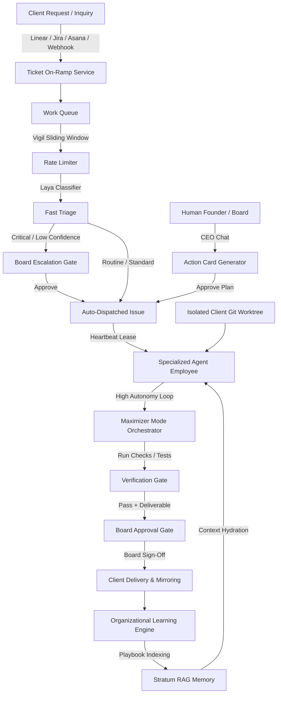

# Autonomous Agency Operating Architecture

## Purpose

This document specifies the end-to-end operational architecture that enables a solo freelancer to govern virtual agent teams across multiple concurrent client accounts. It details the data flow, control checkpoints, and runtime coordination between Paperclip's services.

---

## 1. Client Intake & Work Queue Pipeline

When a client submits a feature request, bug report, or query through an external channel:
1. **On-Ramp Ingestion** (`ticket-on-ramps.ts`):
   - The webhook or API listener captures the external payload (Linear issue, Jira ticket, Asana task).
   - An `external_objects` row is created, associating the external ID, company ID, and metadata with Paperclip.
2. **Rate Limiting & Traffic Shaping** (`work-queues.ts` - Vigil Algorithm):
   - Ingestion is evaluated against a sliding-window rate limiter per queue key (`rateLimitPerMinute`).
   - If the rate is exceeded, the request receives an exponential backoff header or is held in queue without overloading agents.
3. **Dead-Letter Quarantine (DLQ)**:
   - Malformed payloads or unresolvable formats are quarantined in `work_queue_items` with status `dead_letter` and an error categorization tag (`schema_validation_error`, `unsupported_format`).
4. **Laya Fast Triage**:
   - The heuristic classifier assesses urgency, domain, and confidence.
   - **Critical issues** (e.g., production outages) or classifications with confidence $< 0.65$ are marked for human board review.
   - **Routine requests** are automatically converted into a structured `issue` with assigned priority, tags, and the designated agent specialist.

---

## 2. Strategic Steering via CEO Chat

When the founder directs organizational strategy or plans complex initiatives:
1. **Executive Dialogue** (`ceo-chat.ts`):
   - The founder inputs high-level directives via the CEO Chat interface (e.g., *"Set up Client Alpha's authentication service and prepare API documentation"*).
2. **Intent Classification & Action Cards**:
   - The classifier identifies whether the message requires an issue draft, a multi-issue plan decomposition, or a governance approval request.
   - The system responds with a typed, interactive **Action Card** in the UI, containing pre-populated fields, sub-tasks, and target assignees.
3. **Founder Review & Execution**:
   - The founder inspects the card, adjusts scope if necessary, and clicks **Approve & Execute**.
   - The system atomically creates the issue tree and wakes the designated agents.

---

## 3. Autonomous Execution & Context Hydration

When an agent wakes on a heartbeat to work on an issue:
1. **Stratum RAG Context Hydration** (`stratum-engine.ts`, `company-memory.ts`):
   - The issue title and description query the company's memory store.
   - BM25 sparse keyword ranking and semantic overlap scoring are evaluated across past client decisions, design documents, and style guides.
   - Stratum applies exact Reciprocal Rank Fusion ($k=60$) to select the top relevant references.
   - The formatted context block is injected directly into `paperclipTaskMarkdown` before the agent begins work.
2. **Workspace Isolation**:
   - The agent operates in a dedicated Git worktree or isolated sandbox bound exclusively to the target client project.
   - No cross-client file access is permitted.
3. **Maximizer Mode Operating Loop** (`maximizer-orchestrator.ts`):
   - The agent executes tools, inspects source files, edits code, and runs local test suites.
   - **Circuit Breaker**: If the agent repeats the exact same tool call sequence 3 times without progress, the stagnation circuit breaker halts the run and prompts for course correction.
   - **Budget Safeguard**: Token spend is tracked per run; exceeding thresholds auto-pauses the agent.

---

## 4. Verification & Client Delivery

Before any task is marked complete:
1. **Run Requirement Verification Gate**:
   - The system checks that the agent executed mandatory test suites and that test logs show `0 failed` defects.
2. **Deliverable Work Product Upload**:
   - Deliverables (code commits, documentation, assets, summary reports) are registered as inspectable Paperclip work products with content hashes.
3. **Board Approval Gate**:
   - Client-facing deliverables transition to status `review` or `pending_approval`.
   - The founder receives an approval notification on the board.
4. **Outbound Mirroring**:
   - Upon founder sign-off, `ticket-on-ramps.ts` mirrors the resolution comment, status update, and deliverable links back to the client's external ticket system (Linear/Jira/Asana).

---

## 5. Organizational Learning & Continuous Improvement

Upon successful completion of a deliverable:
1. **Playbook Distillation** (`organizational-learning.ts`):
   - The issue's goal, comments, solution approach, and files touched are distilled into a standardized Markdown Playbook (`doc/playbooks/YYYY-MM-DD-<slug>.md`).
2. **Memory Ingestion**:
   - The playbook is parsed into layout-aware chunks with breadcrumb navigation and indexed into `memory_records` with tier `consolidated`.
   - Subsequent client tasks in similar domains immediately retrieve this playbook, preventing recurring mistakes and accelerating delivery.
