# Paperclip Unified Autonomous Control Plane Architecture & Roadmap

Date: 2026-09-27  
Status: Proposed (Closed-Loop Native Architecture)  

This document defines the unified, self-reinforcing control plane architecture that links all 8 strategic initiatives into a single closed loop, without altering Paperclip's core goal or adding external runtime bloat.

---

## 1. Core Principles: Lean, Unified & Governed

1. **Closed-Loop Feedback**:
   Every capability feeds directly into the next:
   - **Inflow**: BYO Tickets (Linear/Jira/Asana), Work Queues, and CEO Chat all resolve into canonical **Issues**.
   - **Execution**: Issues check out to agents running in **Maximizer Mode**, which hydrate context from **Memory/Knowledge**, invoke audited **Connected Apps**, enforce verification before completion, and pause at **Circuit Breakers** on loops or budget limits.
   - **Learning**: Completed, verified work is distilled by **Automatic Organizational Learning** into **Playbooks** and stored back in **Memory/Knowledge** for future tasks.
   - **Evolution**: Work queue pressure and execution bottlenecks trigger **Self-Organization Proposals**, which must pass human **Approval Gates** before updating company roles or routines.

2. **Zero External Dependency Bloat**:
   All core algorithms are native TypeScript within the Paperclip mono-repo:
   - Layout-aware markdown parsing with table preservation and BM25 + exact Reciprocal Rank Fusion ($k=60$) (Stratum RAG pattern).
   - Deterministic `THINK` $\to$ `CALL` $\to$ `VERIFY` $\to$ `FINAL` state loop with identical-call circuit breakers (Kratos Engine pattern).
   - Sliding-window rate-limiting ring buffer and dead-letter quarantine (Vigil Stream pattern).
   - Sub-millisecond typed probability triage (Laya decision pattern).
   - Fast episodic trace $\to$ consolidated playbook learning (Continual AI & VeriGRPO patterns).

3. **Preserving Control-Plane Invariants**:
   - Single-assignee task model
   - Atomic issue checkout semantics
   - Approval gates for governed actions
   - Budget hard-stop auto-pause behavior
   - Activity logging for mutating actions
   - Company-scoping on all entities

---

## 2. High-Level Closed-Loop Architecture

```mermaid
flowchart TD
    subgraph IntakeLayer ["1. INTAKE CONVERGENCE"]
        BYO["BYO Tickets (Jira / Linear / Asana)"] -->|Webhook Sync| WQ["Work Queues (Sliding Window & Triage)"]
        CEO["CEO Chat Interface"] -->|Action Resolver| ISSUES["Paperclip Issues (Canonical Backlog)"]
        WQ -->|Auto-Dispatch| ISSUES
    end

    subgraph MemoryLayer ["2. INSTITUTIONAL MEMORY & KNOWLEDGE"]
        MEM["Stratum Hybrid Knowledge Base"]
        PLAYBOOKS["Company Playbooks (/playbooks/*.md)"]
        MEM <--> PLAYBOOKS
    end

    subgraph ExecutionLayer ["3. AUTONOMOUS EXECUTION (MAXIMIZER MODE)"]
        ISSUES -->|Atomic Checkout| AGENT["Assigned Agent Run"]
        MEM -->|1. THINK: Context & Playbook Hydration| AGENT
        AGENT -->|2. CALL: Governed Tool Execution| APPS["Connected Apps (Vercel, Git, MCP)"]
        AGENT -->|3. VERIFY: Test & Lint Validation| VERIFY["Verification Engine"]
        VERIFY -->|Failed Checks| AGENT
        AGENT -.->|Stagnation / Budget Breach| CB["Circuit Breaker -> Blocked for Approval"]
        VERIFY -->|Verified Success| DONE["Issue Completed (DONE)"]
    end

    subgraph LearningLayer ["4. AUTOMATIC ORGANIZATIONAL LEARNING"]
        DONE --> DISTILL["Knowledge Distillation Service"]
        DISTILL -->|Extract Playbook & Heuristics| PLAYBOOKS
        DISTILL -->|Record Exemplar & Trajectory| MEM
    end

    subgraph EvolutionLayer ["5. GOVERNED SELF-ORGANIZATION"]
        AGENT -->|Detect Bottleneck / Repetition| PROPOSE["Structural Mutation Proposal"]
        WQ -->|Volume Pressure| PROPOSE
        PROPOSE --> APPR["Approval Gate (Human Operator)"]
        APPR -->|Accepted| ORG["Update Agent Roles / Delegation / Routines"]
        ORG --> ISSUES
    end
```

---

## 3. Subsystem Specifications & Linkages

### 3.1 Intake Convergence (Work Queues, BYO Tickets, CEO Chat $\to$ Issues)
- **Work Queues (`server/src/services/work-queues.ts`)**:
  - Ingests high-frequency webhooks into sliding-window rate limiters.
  - Classifies payloads with fast typed probabilities (Laya pattern) for category, severity, domain, and auto-dispatch eligibility.
  - Generates Paperclip issues with linked `queue_id`.
- **BYO Ticket Systems (`server/src/services/ticket-on-ramps.ts`)**:
  - Bi-directional sync connecting Jira, Linear, and Asana via `external_objects`.
  - External tickets feed into work queues; Paperclip status changes and final artifacts mirror back to external tickets.
- **CEO Chat (`server/src/services/ceo-chat.ts`)**:
  - Executive conversational interface using an issue-backed model (preserving task-and-comment invariants).
  - Automatically resolves user prompts into structured Action Cards (draft issue, plan decomposition, approval request) that the human can approve with one click.

### 3.2 Autonomous Execution (Maximizer Mode & Connected Apps)
- **Maximizer Mode (`server/src/services/maximizer-orchestrator.ts`)**:
  - Activated by `execution_policy.mode = 'maximizer'`.
  - **`THINK`**: Retrieves institutional memory and verified playbooks via `companyMemoryService.hydrateAgentContext`.
  - **`CALL`**: Dispatches tools through sandboxes and audited connected apps (Vercel, GitHub, Cloud).
  - **`VERIFY`**: Prohibits completion until verification checks (running unit tests, lint checks, file diff verification) pass.
  - **Circuit Breaker**: Trips on repeated identical tool calls or budget ceiling, pausing the run as `blocked_for_approval`.

### 3.3 Automatic Organizational Learning & Institutional Memory
- **Organizational Learning (`server/src/services/organizational-learning.ts`)**:
  - Post-run hook on verified successful issues.
  - Distills the problem signature, solution commands, and diffs into an immutable Markdown Playbook in `documents` (`/playbooks/<slug>.md`).
  - Ingests the playbook via `companyMemoryService.ingestDocument` with `tier: 'consolidated'`.
  - Subsequent tasks facing similar problems automatically hydrate this playbook during `THINK`.

### 3.4 Governed Self-Organization
- **Self-Organization (`server/src/services/self-organization.ts`)**:
  - Agents identify bottlenecks or repetitive maintenance tasks and propose structural mutations (`adjust_role`, `create_routine`, `rebalance_queue`).
  - Rendered as an interactive visual diff card in Paperclip's native `approvals` system.
  - Requires human operator sign-off before modifying live company configuration, recorded in `activity_log`.

---

## 4. Phased Execution & Status

1. **Phase 1 (Completed & Verified)**:
   - Stratum RAG layout parser (table preservation + breadcrumbs), BM25, and exact RRF ($k=60$) search.
   - Company Memory database schema, migrations (`0285_certain_tempest.sql`), and REST endpoints.
   - Work Queues sliding-window rate limiter, DLQ, and Laya fast triage classifier.
2. **Phase 2 (Completed & Verified)**:
   - Maximizer Mode deterministic state loop (`THINK` $\to$ `CALL` $\to$ `VERIFY` $\to$ `FINAL`), circuit breakers, and verification gate (`src/services/maximizer-orchestrator.ts`).
   - CEO Chat conversational interface resolving to Work Action Cards (`draft_issue`, `plan_decomposition`, `approval_request`) and API routes.
3. **Phase 3 (Completed & Verified)**:
   - Automatic Organizational Learning auto-distilling completed runs into Markdown playbooks and ingesting them into tiered company memory (`src/services/organizational-learning.ts`).
   - BYO Ticket On-Ramp Adapter supporting Linear, Jira, and Asana payload ingestion and `external_objects` binding (`src/services/ticket-on-ramps.ts`).
4. **Phase 4 (Completed & Verified)**:
   - Governed Self-Organization proposals (`adjust_role`, `create_routine`, `rebalance_queue`) passing through Paperclip approval gates and applying on sign-off (`src/services/self-organization.ts`).
   - Connected Apps integration through native Paperclip company tooling gateways.

### Verification Status
- **Typecheck**: Full repository typecheck passed cleanly (`pnpm -r typecheck` with 0 errors).
- **Unit Test Suite**: 7 dedicated service test suites (19 / 19 tests passing).
- **Invariants**: Single-assignee task model, company isolation, and approval gates strictly preserved.
