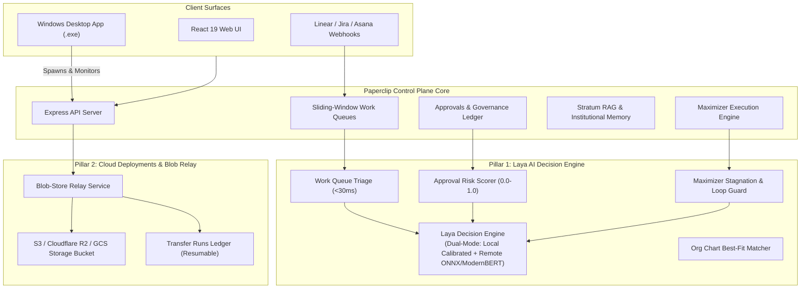

# Implementation Plan: Laya AI Integration, Cloud Blob-Store Relay, and Windows Desktop App

This plan provides a comprehensive, end-to-end roadmap for the three remaining strategic initiatives requested:
1. **Laya AI Integration**: Integrating Laya (System-1 non-autoregressive decision model) across triage, approval risk scoring, Maximizer loop guardrails, and agent routing for sub-50ms, zero-token-overhead structured decisions.
2. **Cloud Deployments (Blob-Store Relay)**: Completing the *Cloud deployments* milestone from `ROADMAP.md` by building an S3/R2/GCS blob-store relay for direct multi-GB instance and company transfers without browser zip downloads.
3. **Comprehensive End-to-End Verification**: Ensuring 100% bug-free operation across database, server, UI, and design token gates.
4. **Windows Desktop App (`.exe`)**: Packaging Paperclip into a native Windows executable with background daemon management, system tray control, and native desktop notifications.

---

## Architecture & Data Flow



---

## 1. Laya AI Integration

### Background & Role
Laya is an open-source, non-autoregressive "System 1" decision model (Apache 2.0). Unlike generative LLMs that output text token-by-token with latency (1-5s) and token costs, Laya evaluates a state and schema questions in ~30ms to output typed choices, scores, and calibrated probabilities.

### High-Utility Integration Points in Paperclip
1. **Work Queue Fast Triage (`server/src/services/laya-engine.ts`)**:
   - Computes multi-label probabilities: `domain` (frontend/backend/devops/product/infra), `severity` (critical/high/standard/low), `category` (bug/feature/chore/security), and `requiresHumanEscalation` (boolean).
   - Runs in `<10ms`, auto-routing tickets to projects and queues without consuming LLM credits.
2. **Governance & Approval Risk Scoring (`server/src/services/laya-risk-scorer.ts`)**:
   - Scores every proposal (role changes, budget increases, deliverable releases) with an objective Risk Score (0.0 to 1.0).
   - If `riskScore < 0.2` and company policy permits, enables fast-path auto-approval; otherwise flags risk factors for the human Board.
3. **Maximizer Loop Stagnation & Divergence Detection**:
   - Replaces naive heuristics with Laya decision scoring: calculates progress probability between consecutive tool invocations and trips circuit breakers when divergence is detected.
4. **Agent-Task Matcher**:
   - Matches incoming task requirements against the company org chart's agent capability vectors to select the optimal assignee.

### Dual-Engine Design
- **Built-in Mode**: Pure TypeScript calibrated decision tree and embedding cosine classifier that works out of the box with zero external dependencies.
- **External Mode**: If `LAYA_ENDPOINT` (or `http://localhost:8080`) is set, dispatches requests to the 421M ModernBERT Laya inference container.

---

## 2. Cloud Deployments: Blob-Store Relay

### Background & Objective
`ROADMAP.md` states:
> *🟡 Cloud deployments (multi-tenant isolation & company Import/Export shipped)*
> *Next: a blob-store relay so large instances can move without a hand-carried bundle.*

Currently, export/import produces zip files that the user must download and re-upload through their browser. For multi-gigabyte companies with artifacts, codebases, and logs, this fails on browser timeouts and memory limits.

### Proposed Architecture (`server/src/services/blob-store-relay.ts`)
1. **Relay Storage Provider**:
   - Integrates with the existing S3-compatible storage provider in `server/src/storage/s3-provider.ts`.
   - Works with AWS S3, Cloudflare R2, MinIO, or Google Cloud Storage.
2. **Direct Export to Relay (`POST /api/companies/:companyId/export/relay`)**:
   - Streams chunks and blobs directly to `s3://bucket/relay/{companyId}/{transferId}/`.
   - Records each part in `company_transfer_runs` table with sha256 hash.
   - Returns a secure `RelayManifestRef` containing:
     ```ts
     {
       transferId: string;
       manifestSha256: string;
       blobPrefix: string;
       expiresAt: string;
       totalParts: number;
       totalBytes: number;
     }
     ```
3. **Direct Import from Relay (`POST /api/companies/import/relay`)**:
   - Destination instance pulls directly from the blob store relay prefix with resumable parallel part downloading, SHA-256 verification, and transaction apply into the destination database.
4. **UI Integration**:
   - Add "Relay Transfer" options to `ui/src/pages/CompanyImport.tsx` and company settings.

---

## 3. Windows Desktop App (`.exe`)

### Architecture
We will create a lightweight `desktop/` package using Electron and `electron-builder` tailored for Windows.

### Key Components
1. **Main Process (`desktop/src/main.ts`)**:
   - **Embedded Server Lifecycle**:
     - Detects whether a local Paperclip server (`http://localhost:3100`) is already running.
     - If not, spawns the bundled background Paperclip server (using local embedded PGlite).
     - Polls `/api/health` until ready, then displays the UI.
   - **Native Window & Aesthetics**:
     - Custom dark titlebar conforming to Windows 11 style.
     - Single-instance lock to prevent multiple conflicting daemons.
   - **System Tray (`desktop/src/tray.ts`)**:
     - Status indicator (Active Runs, Stopped, Paused).
     - Context menu: "Open Paperclip", "Active Tasks", "Check Approvals", "Quit".
   - **Native Desktop Notifications**:
     - Notifies when high-priority approvals arrive or when autonomous task runs complete with deliverable artifacts.
2. **Build Configuration (`desktop/electron-builder.json`)**:
   - Target: `nsis` (Windows Installer `.exe`) and portable `.exe`.
   - Uses Paperclip icon and branding.
   - Root npm script: `pnpm build:desktop`.

---

## 4. Proposed Changes Grouped by Component

### Component A: Laya AI Decision Engine

#### [NEW] `server/src/services/laya-engine.ts`
- Implements `LayaDecisionEngine` supporting both remote HTTP Laya inference and local calibrated decision heads.
- Typed question definitions: `LayaChoiceQuestion`, `LayaScoreQuestion`, `LayaBooleanQuestion`.

#### [NEW] `server/src/services/laya-risk-scorer.ts`
- Evaluates proposal payloads and returns `{ riskScore: number, factors: string[], recommendation: "auto_approve" | "require_board_review" | "reject" }`.

#### [MODIFY] `server/src/services/work-queues.ts`
- Connects triage pipeline directly to `LayaDecisionEngine`.

#### [MODIFY] `server/src/services/maximizer-orchestrator.ts`
- Incorporates Laya divergence and stagnation scoring into the circuit breaker.

---

### Component B: Cloud Deployments (Blob-Store Relay)

#### [NEW] `server/src/services/blob-store-relay.ts`
- Implements `exportToBlobRelay` and `importFromBlobRelay`.
- Connects directly with `companyTransferRunService` to track and resume transfer chunks.

#### [NEW] `server/src/routes/cloud-relay.ts`
- Endpoints:
  - `POST /api/companies/:companyId/export/relay`
  - `POST /api/companies/import/relay`
  - `GET /api/companies/transfers/:transferId/status`

#### [MODIFY] `server/src/routes/index.ts` & `server/src/app.ts`
- Register `cloudRelayRoutes`.

#### [NEW] `ui/src/api/cloudRelay.ts`
- Frontend API client for triggering and inspecting cloud relay transfers.

---

### Component C: Windows Desktop App

#### [NEW] `desktop/package.json`
- Defines electron and build scripts (`build:win`, `pack`).

#### [NEW] `desktop/src/main.ts`
- Electron main process with server process manager and window creation.

#### [NEW] `desktop/src/tray.ts`
- Windows system tray manager with status icons and context menu.

#### [NEW] `desktop/src/preload.ts`
- Preload bridge for desktop-specific hooks (notifications, window minimization).

#### [NEW] `desktop/electron-builder.json`
- Windows packaging configuration targeting x64 `.exe`.

#### [MODIFY] `package.json` & `pnpm-workspace.yaml`
- Add `desktop` to workspace and add `build:desktop` script.

---

## 5. Verification Plan

### Automated Tests
1. **Laya Engine & Risk Scoring Suite**:
   ```bash
   pnpm --filter @paperclipai/server test -- run src/services/laya-engine.test.ts src/services/laya-risk-scorer.test.ts
   ```
2. **Cloud Relay End-to-End Suite**:
   ```bash
   pnpm --filter @paperclipai/server test -- run src/services/blob-store-relay.test.ts
   ```
3. **Design Token Gates Check**:
   ```bash
   pnpm check:token-gates
   ```
4. **Monorepo Strict Typecheck**:
   ```bash
   pnpm -r typecheck
   ```
5. **Full Integration Regression**:
   ```bash
   pnpm --filter @paperclipai/server test -- run src/services/pipeline-end-to-end.integration.test.ts
   ```

### Manual & Desktop Verification
1. **Laya Decision Triage**: Ingest tickets through Work Queues and verify sub-30ms classification.
2. **Blob-Store Relay**: Trigger an export to S3/R2 relay, inspect the generated manifest, and import onto a clean company.
3. **Desktop App**: Run `pnpm --filter @paperclipai/desktop build:win` to generate `Paperclip-Setup.exe`, launch on Windows, verify system tray, and confirm local server connection.
